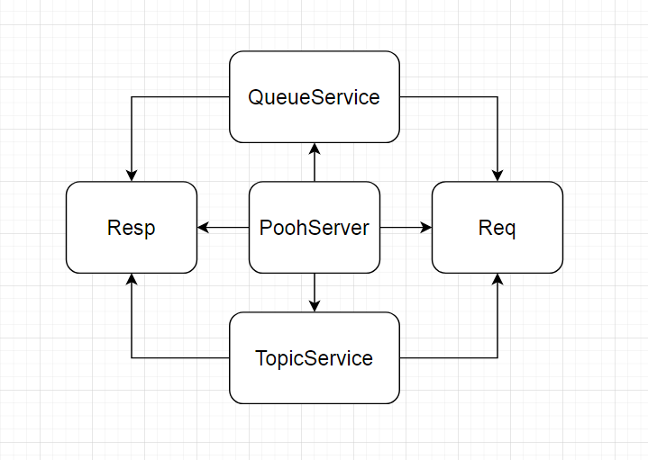

# job4j_pooh

Проект — аналог асинхронной очереди. Приложение запускает Socket и ждет клиентов. Клиенты могут быть двух типов:
отправители (publisher)
и получатели (subscriber). Имеется два режима: queue, topic.

### Queue

Отправитель посылает сообщение с указанием очереди. Получатель читает первое сообщение и удаляет его из очереди. Если
приходят несколько получателей, то они читают из одной очереди. Уникальное сообщение может быть прочитано, только одним
получателем.

#### Пример POST запроса:

curl -X POST -d "temperature=18" http://localhost:9000/queue/weather

- queue - указывает на режим очередь.

- weather - указывает на имя очереди. Если такой очереди нет в сервисе, то создаётся новая очередь.

- "temperature=18" - сообщение, добавляемое в очередь.

Ответ: temperature=18

#### Пример GET запроса:

curl -X GET http://localhost:9000/queue/weather

Ответ: temperature=18

### Topic

У каждого получателя уникальная очередь потребления. Отправитель посылает сообщение с указанием темы. Получатель читает
первое сообщение и удаляет его из очереди.

#### Пример POST запроса:

curl -X POST -d "temperature=18" http://localhost:9000/topic/weather

- topic - указывает на режим темы.

- weather - указывает на имя темы. Если такой темы нет в сервисе, то создается новая.

- "temperature=18" - сообщение, добавляемое в тему.

Ответ: temperature=18

#### Пример GET запроса:

curl -X GET http://localhost:9000/topic/weather/1

- 1 - указывает на ID клиента.

Ответ: temperature=18

### Архитектура проекта

